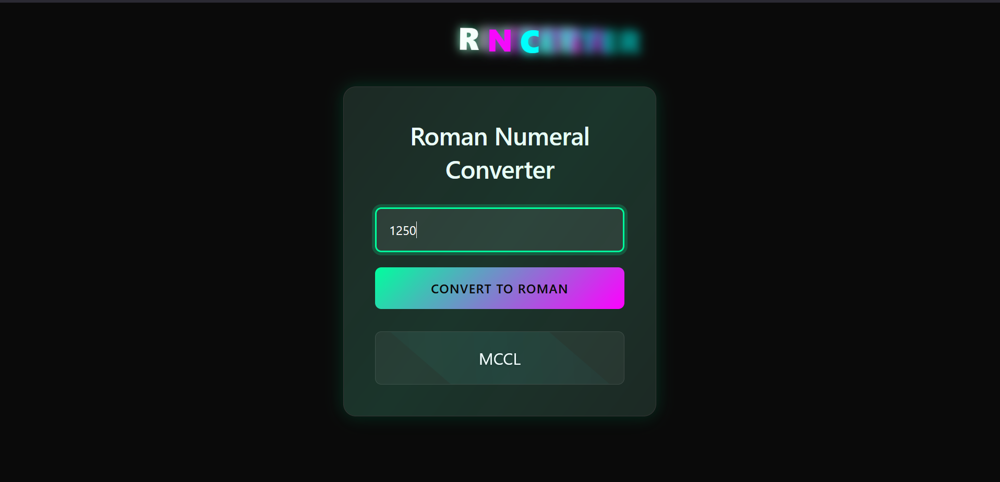

Here i asked AI for help with the different steps on how to make a Decimal to Roman Numeral converter.  
What i understood was first we iterate through each Roman Numeral key value pair then for example if our number is 1200, it will 
subtract 1000 which corresponds to `"M"`.  
Until the number input is not yet 0 it will keep on subtracting the Roman Numeral value then append the symbol for each successful subtraction until it becomes 0. Then the total appended symbols is the final Roman Numeral result. 
