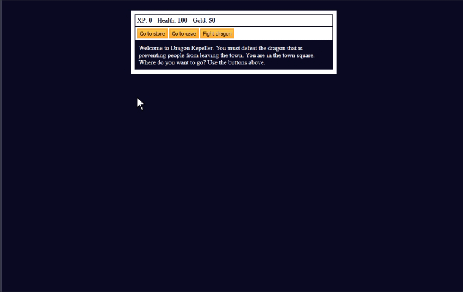

## Basic JavaScript

 ## Learned about
 - arrays - `[]`
 - strings - `" "`
 - objects - `{}`
 - functions - `attack()`
 - loops - `for`,`while`
 - if/else statements - `if(){ }`,`else{ }`
- `Math.floor(Math.random() * 10) + 1` - Generate Random numbers from 1 to 10
