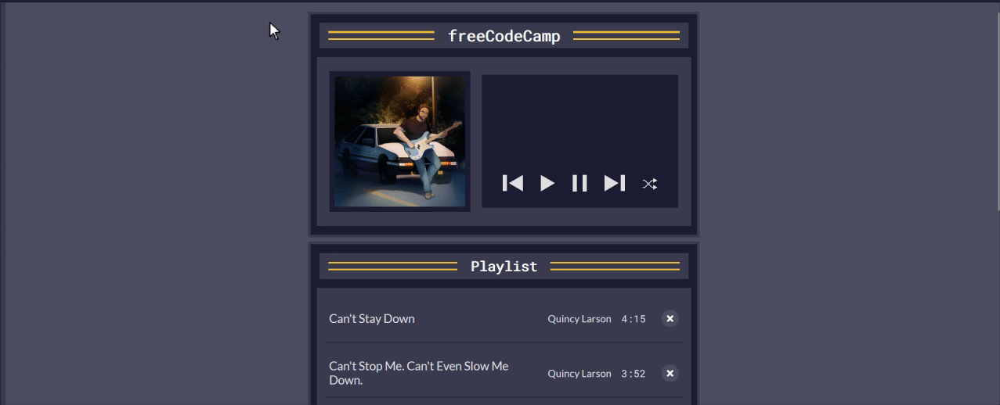

JavaScript Methods:
find(), forEach(), map(), and join(). These methods are crucial for developing dynamic web applications.

The project covers fundamental concepts such as handling audio playback, managing a playlist, implementing play, pause, next, previous, and shuffle functionalities. You'll even learn how to dynamically update your user interface based on the current song.
