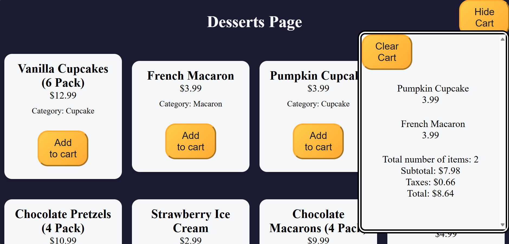

# Basic Object-Oriented Programming (OOP) in JavaScript



### 1. Objects
In JavaScript, an object is a standalone entity, with properties and type. Objects can represent real-world entities and can contain data in the form of key-value pairs. In `script.js`, we utilize objects to represent the cart and its items.

### 2. Classes
Classes are a blueprint for creating objects. They encapsulate data for the object and methods to manipulate that data. In the `script.js`, we define classes to represent the `Cart` and `Product`:

```javascript
class Product {
    constructor(id, name, price) {
        this.id = id;
        this.name = name;
        this.price = price;
    }
}

class ShoppingCart {
    constructor() {
        this.items = [];
        this.total = 0;
        this.taxRate = 8.25;
    }

    addItem(id, products) {
       const product = products.find((item) => item.id === id);
    const { name, price } = product;
    this.items.push(product);

    const totalCountPerProduct = {};
    this.items.forEach((dessert) => {
      totalCountPerProduct[dessert.id] = (totalCountPerProduct[dessert.id] || 0) + 1;
    })

    const currentProductCount = totalCountPerProduct[product.id];
    const currentProductCountSpan = document.getElementById(`product-count-for-id${id}`);

    currentProductCount > 1 
      ? currentProductCountSpan.textContent = `${currentProductCount}x`
      : productsContainer.innerHTML += `
      <div id="dessert${id}" class="product">
        <p>
          <span class="product-count" id="product-count-for-id${id}"></span>${name}
        </p>
        <p>${price}</p>
      </div>
      `;
    }

    getCounts() {
        return this.items.length;
    }

    clearCart() {
if (!this.items.length) {
      alert("Your shopping cart is already empty");
      return;
    }

    const isCartCleared = confirm(
      "Are you sure you want to clear all items from your shopping cart?"
    );

    if (isCartCleared) {
      this.items = [];
      this.total = 0;
      productsContainer.innerHTML = "";
      totalNumberOfItems.textContent = 0;
      cartSubTotal.textContent = 0;
      cartTaxes.textContent = 0;
      cartTotal.textContent = 0;
    }
    }

    calculateTaxes(amount) {
        return parseFloat(((this.taxRate / 100) * amount).toFixed(2));
    }

    calculateTotal() {
const subTotal = this.items.reduce((total, item) => total + item.price, 0);
    const tax = this.calculateTaxes(subTotal);
    this.total = subTotal + tax;
    cartSubTotal.textContent = `$${subTotal.toFixed(2)}`;
    cartTaxes.textContent = `$${tax.toFixed(2)}`;
    cartTotal.textContent = `$${this.total.toFixed(2)}`;
    return this.total;
    }
}
```

### Calling the class
Here we called ShoppingCart() class. 
Then for each "Add to cart" button we would add the product item to the cart and get the total amount of items.

```js
const cart = new ShoppingCart();
const addToCartBtns = document.getElementsByClassName("add-to-cart-btn");

[...addToCartBtns].forEach(
  (btn) => {
    btn.addEventListener("click", (event) => {
      cart.addItem(Number(event.target.id), products);
      totalNumberOfItems.textContent = cart.getCounts();
      cart.calculateTotal();
    })
  }
);

```

## Implementation in script.js
- **Product Class**: Represents a product with properties like `id`, `name`, and `price`.
- **Cart Class**: Manages the shopping cart, allowing items to be added and calculating totals.
  - **Methods**:
    - `addItem(id, products)`: Adds an item to the cart based on its ID.
    - `getCounts()`: Returns the total number of items in the cart.
    - `clearCart()`: Clears all items from the cart after user confirmation.
    - `calculateTaxes(amount)`: Calculates the tax amount based on the subtotal.
    - `calculateTotal()`: Calculates the total amount including taxes and updates the display.
