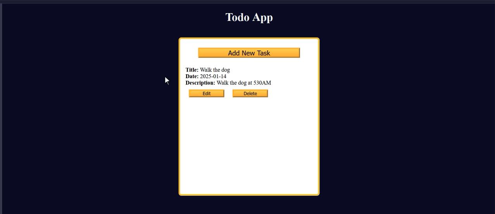

## TodoList

Learned about localStorage: setItem(), getItem(), removeItem(), clear()

Also learned about:
- JSON.stringify(): Turns objects into readable strings.
- JSON.parse(): Turns strings into objects.
- trim(): Removes whitespace from both sides.
- findIndex(): It returns the array element index if any of the elements in the array pass the test, otherwise, it returns -1. 
