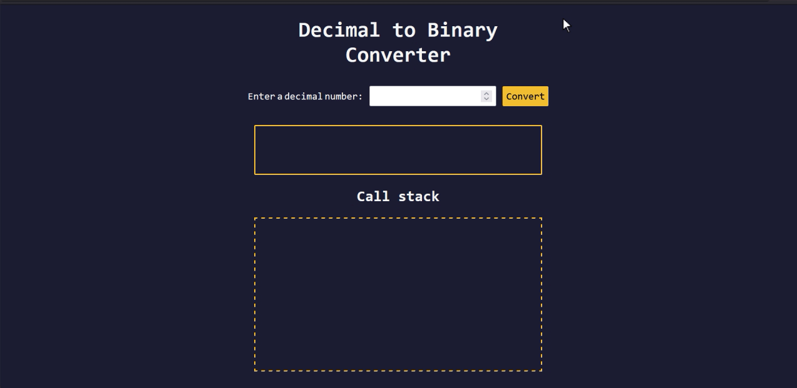

## Learned about Recursion



Example - Converting decimal to Binary: 

```js
const decimalToBinary = (input) => {
  if (input === 0 || input === 1) {
    return String(input);
  } else {
    return decimalToBinary(Math.floor(input / 2)) + (input % 2);
  }
};
```


- `setTimeout()` - Asynchronous function to add delay
- `parseInt()` - parse a string and convert it into an integer
- `isNaN()` -  determine whether a value is NaN (Not-a-Number)

Learned about keydown:

Example - Pressing Enter key

```js
numberInput.addEventListener("keydown", (e) => {
  if (e.key === "Enter") {
    checkUserInput();
  }
```
