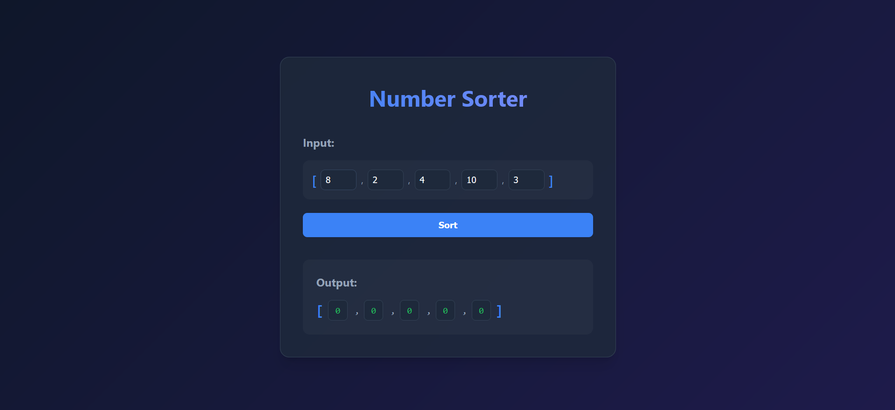

# Number Sorter


## Bubble Sort
Bubble Sort is the simplest sorting algorithm that works by repeatedly swapping the adjacent elements if they are in the wrong order. This algorithm is not suitable for large data sets as its average and worst-case time complexity are quite high.<br>


```js
const bubbleSort = (array) => {
  for (let i = 0; i < array.length; i++) {
    for (let j = 0; j < array.length - 1; j++) {
      if (array[j] > array[j + 1]) {
        const temp = array[j];
        array[j] = array[j + 1];
        array[j + 1] = temp;
      }
    }
  }

  return array;
}
```


## Selection Sort
Selection Sort is a comparison-based sorting algorithm. It sorts an array by repeatedly selecting the smallest (or largest) element from the unsorted portion and swapping it with the first unsorted element. This process continues until the entire array is sorted.

<br>


```js
const selectionSort = (array) => {
  for (let i = 0; i < array.length; i++) {
    let minIndex = i;

    for (let j = i + 1; j < array.length; j++) {
      if (array[j] < array[minIndex]) {
        minIndex = j;
      }
    }

    const temp = array[i];
    array[i] = array[minIndex];
    array[minIndex] = temp;
  }

  return array;
}
```

## Insertion sort

Insertion sort is a simple sorting algorithm that works by iteratively inserting each element of an unsorted list into its correct position in a sorted portion of the list. It is like sorting playing cards in your hands. You split the cards into two groups: the sorted cards and the unsorted cards. Then, you pick a card from the unsorted group and put it in the right place in the sorted group.<br>

- We start with second element of the array as first element in the array is assumed to be sorted.
- Compare second element with the first element and check if the second element is smaller then swap them.
- Move to the third element and compare it with the first two elements and put at its correct position
- Repeat until the entire array is sorted.
  

```js
const insertionSort = (array) => {
  for (let i = 1; i < array.length; i++) {
    const currValue = array[i];
    let j = i - 1;

    while (j >= 0 && array[j] > currValue) {
      array[j + 1] = array[j];
      j--;
    }
    array[j + 1] = currValue;
  }
  return array;
}
```

.sort() - Here it checks if result of a - b is negative, positive or 0. <br>
if a - b is negative - a comes before b.
if a - b is positive - a comes after b.
if a - b is 0 - no changes made.

```js
const sortedValues = inputValues.sort((a, b) => {
    return a - b;
  });
```
