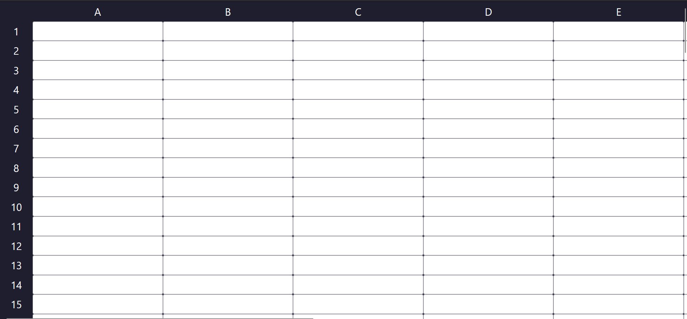

# Functional Programming Spreadsheet


This project demonstrates the power of functional programming in JavaScript by implementing a spreadsheet application. The implementation heavily relies on functional programming concepts such as pure functions, higher-order functions, and function composition.

## Core Functional Programming Concepts Used

### 1. Pure Functions
The codebase extensively uses pure functions, which always produce the same output for the same input and have no side effects:

```javascript
const infixToFunction = {
    "+": (x, y) => x + y,
    "-": (x, y) => x - y,
    "*": (x, y) => x * y,
    "/": (x, y) => x / y
}
```
These arithmetic functions are pure - they always return the same result for the same inputs.

### 2. Higher-Order Functions
Functions that take other functions as arguments or return functions:

```javascript
const highPrecedence = str => {
    const regex = /([\d.]+)([*\/])([\d.]+)/;
    const str2 = infixEval(str, regex);
    return str === str2 ? str : highPrecedence(str2);
}
```
This recursive function uses function composition and takes functions as arguments.

### 3. Array Methods (Functional Operations)
The code leverages JavaScript's built-in array methods that follow functional programming principles:

```javascript
// Using reduce for sum
const sum = nums => nums.reduce((acc, el) => acc + el, 0);

// Using filter for even numbers
even: nums => nums.filter(isEven),

// Using map for increments
increment: nums => nums.map(num => num + 1),

// Using slice for array portions
firsttwo: nums => nums.slice(0, 2),
```

### 4. Function Composition
Complex operations are built by combining simpler functions:

```javascript
const average = nums => sum(nums) / nums.length;

const median = nums => {
    const sorted = nums.slice().sort((a, b) => a - b);
    const length = sorted.length;
    const middle = length / 2 - 1;
    return isEven(length)
        ? average([sorted[middle], sorted[middle + 1]])
        : sorted[Math.ceil(middle)];
}
```

## Spreadsheet Functions Implementation

### 1. Core Spreadsheet Functions
```javascript
const spreadsheetFunctions = {
   sum, // sum of numbers
    average, // average of numbers
    median, // median of numbers
    even: nums => nums.filter(isEven), // filter even numbers
    someeven: nums => nums.some(isEven), // check if some numbers are even
    everyeven: nums => nums.every(isEven), // check if all numbers are even
    firsttwo: nums => nums.slice(0, 2), // get the first two elements
    lasttwo: nums => nums.slice(-2), // get the last two elements
    has2: nums => nums.includes(2), // check if 2 is in the array
    increment: nums => nums.map(num => num + 1), // increment each number
    random: ([x, y]) => Math.floor(Math.random() * y + x), // generate random number between x and y
    range: nums => range(...nums), // generate number range
    nodupes: nums => [...new Set(nums).values()], // remove duplicates
    '': args => args // identity function
}
```

### 2. Range Generation (Functional Approach)
```javascript
// range() generates an array of numbers from start to end (inclusive)
// It works by creating an array of length (end - start + 1), 
// filling it with the value of start, and then mapping over it to 
// add the index to each element
const range = (start, end) => 
    Array(end - start + 1)
        .fill(start)
        .map((element, index) => element + index);

// charRange() generates an array of characters from start to end (inclusive)
// It works by using range() to generate an array of character codes, 
// and then mapping over it to convert each code to a character
const charRange = (start, end) => 
    range(start.charCodeAt(0), end.charCodeAt(0))
        .map(code => String.fromCharCode(code));
```

### 3. Formula Evaluation Pipeline
```javascript
const evalFormula = (x, cells) => {
    // Function composition for cell reference resolution
    const idToText = id => cells.find(cell => cell.id === id).value;
    
    // Pattern matching using regex
    const rangeRegex = /([A-J])([1-9][0-9]?):([A-J])([1-9][0-9]?)/gi;
    
    // Functional transformations
    const rangeFromString = (num1, num2) => range(parseInt(num1), parseInt(num2));
    const elemValue = num => character => idToText(character + num);
    const addCharacters = character1 => character2 => num => 
        charRange(character1, character2).map(elemValue(num));
}
```

## Benefits of Functional Programming in this Implementation

1. **Immutability**
   - Functions don't modify external state
   - Each operation returns new data
   - Reduces bugs from state mutations

2. **Composability**
   - Functions can be combined easily
   - Complex operations built from simple ones
   - Clear data transformation pipeline

3. **Testability**
   - Pure functions are easy to test
   - Predictable outputs
   - Isolated functionality

4. **Readability**
   - Declarative code style
   - Clear function purposes
   - Modular structure

## Usage Examples

### Basic Operations
```javascript
"=A1+B1"    // Addition
"=C1*D1"    // Multiplication
"=E1/F1"    // Division
```

### Function Calls
```javascript
"=SUM(A1:A5)"           // Sum range
"=AVERAGE(B1:B10)"      // Average range
"=MEDIAN(C1:C7)"        // Find median
"=NODUPES(D1:D10)"      // Remove duplicates
```

### Advanced Features
```javascript
"=RANDOM(1,100)"        // Random number
"=INCREMENT(A1:A5)"     // Add 1 to each
"=EVERYEVEN(B1:B5)"     // Check if all even
```

This implementation showcases how functional programming principles can create a robust, maintainable spreadsheet application with clear data flow and predictable behavior.
