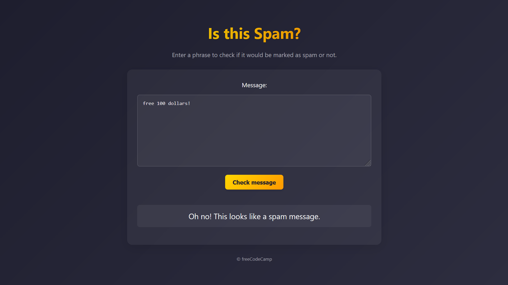

.some() - Matches atleast 1 occurrence 

```js
const isSpam = (msg) => denyList.some((regex) => regex.test(msg));
```
.test() - for simple checks (e.g., validation).

```js
const regex = /hello/;
console.log(regex.test("hello world")); // Output: true
console.log(regex.test("goodbye world")); // Output: false
```

.match() - for extracting matched text or details (e.g., capture groups).

```js
const regex = /(\d{4})-(\d{2})-(\d{2})/; // Matches a date in YYYY-MM-DD format
const match = "2023-10-25".match(regex);
console.log(match[0]); // Output: "2023-10-25" (the entire match)
console.log(match[1]); // Output: "2023" (first capture group)
console.log(match[2]); // Output: "10" (second capture group)
console.log(match[3]); // Output: "25" (third capture group)
```

1. helpRegex
```js
const helpRegex = /please help|assist me/i;
```
Explanation:

    Pattern: please help|assist me

        | means OR, so it matches either please help or assist me.

    Flags:

        i: Case-insensitive matching (e.g., matches Please Help, ASSIST ME, etc.).

    Matches:

        "please help"

        "assist me"

        "PLEASE HELP"

        "Assist Me"


2. dollarRegex
```js
const dollarRegex = /[0-9]+\s*(?:hundred|thousand|million|billion)?\s+dollars/i;
```
Explanation:

    Pattern:

        [0-9]+: Matches one or more digits (e.g., 100, 5000, 1).

        \s*: Matches zero or more whitespace characters (e.g., spaces, tabs).

        (?:hundred|thousand|million|billion)?: A non-capturing group that matches hundred, thousand, million, or billion. The ? makes this group optional.

        \s+: Matches one or more whitespace characters.

        dollars: Matches the literal word dollars.

    Flags:

        i: Case-insensitive matching.

    Matches:

        "100 dollars"

        "1 million dollars"

        "5000 DOLLARS"

        "10 thousand dollars"

    Non-Matches:

        "100 euros" (does not end with dollars)

        "hundred dollars" (no digits before hundred)


3. freeRegex
```js
const freeRegex = /(?:^|\s)fr[e3][e3] m[o0]n[e3]y(?:$|\s)/i;
```
Explanation:

    Pattern:

        (?:^|\s): A non-capturing group that matches either:

            ^: The start of the string.

            \s: A whitespace character.

        fr[e3][e3]: Matches free, fr3e, fr33, etc. The [e3] allows for e or 3 as substitutions.

        m[o0]n[e3]y: Matches money, m0ney, mon3y, etc. The [o0] allows for o or 0, and [e3] allows for e or 3.

        (?:$|\s): A non-capturing group that matches either:

            $: The end of the string.

            \s: A whitespace character.

    Flags:

        i: Case-insensitive matching.

    Matches:

        "free money"

        "fr3e m0ney"

        "FR33 MON3Y"

        "I want free money"

        "free money is great"

    Non-Matches:

        "freemoney" (no space between free and money)

        "for free money" (if free money is not at the start or end or surrounded by spaces)


4. stockRegex
```js
const stockRegex = /(?:^|\s)[s5][t7][o0][c{[(]k [a@4]l[e3]r[t7](?:$|\s)/i;
```
Explanation:

    Pattern:

        (?:^|\s): A non-capturing group that matches either:

            ^: The start of the string.

            \s: A whitespace character.

        [s5]: Matches s or 5.

        [t7]: Matches t or 7.

        [o0]: Matches o or 0.

        [c{[(]: Matches c, {, [, or (.

        k: Matches the literal k.

        [a@4]: Matches a, @, or 4.

        l[e3]: Matches le or l3.

        r[t7]: Matches rt or r7.

        (?:$|\s): A non-capturing group that matches either:

            $: The end of the string.

            \s: A whitespace character.

    Flags:

        i: Case-insensitive matching.

    Matches:

        "stock alert"

        "5t0ck @l3rt"

        "ST0CK AL3RT"

        "I need a stock alert"

    Non-Matches:

        "stockalert" (no space between stock and alert)

        "for stock alert" (if stock alert is not at the start or end or surrounded by spaces)


5. dearRegex
```js
const dearRegex = /(?:^|\s)d[e3][a@4]r fr[i|1][e3]nd(?:$|\s)/i;
```
Explanation:

    Pattern:

        (?:^|\s): A non-capturing group that matches either:

            ^: The start of the string.

            \s: A whitespace character.

        d[e3][a@4]r: Matches dear, d3ar, d@ar, etc. The [e3] allows for e or 3, and [a@4] allows for a, @, or 4.

        fr[i|1][e3]nd: Matches friend, fr1end, fri3nd, etc. The [i|1] allows for i, |, or 1, and [e3] allows for e or 3.

        (?:$|\s): A non-capturing group that matches either:

            $: The end of the string.

            \s: A whitespace character.

    Flags:

        i: Case-insensitive matching.

    Matches:

        "dear friend"

        "d3@r fr1end"

        "DEAR FR13ND"

        "Hello dear friend"

    Non-Matches:

        "dearfriend" (no space between dear and friend)

        "for dear friend" (if dear friend is not at the start or end or surrounded by spaces)


